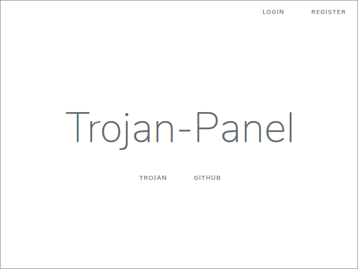
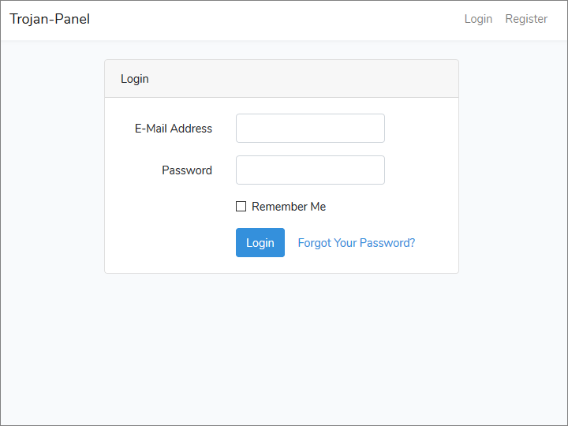
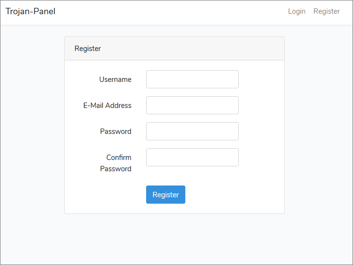
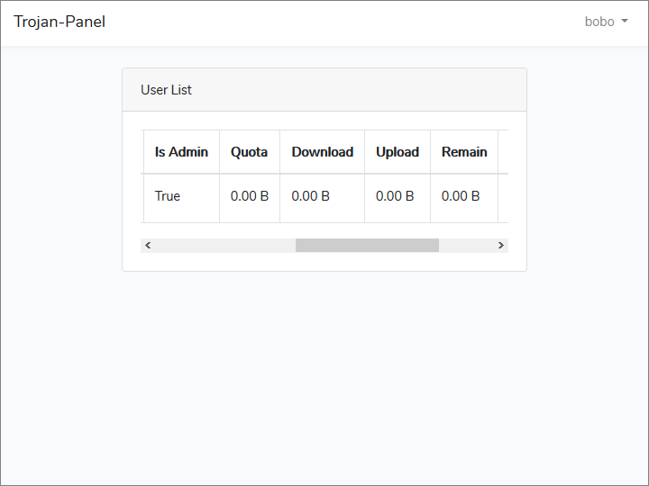

# trojan-panel
A Trojan user management panel based on Laravel.









## Installation on Ubuntu Server 18.04 LTS

### 1. Install Nginx

Open ports TCP/80 and TCP/443 in firewall:

```
sudo iptables -A INPUT -p tcp --dport 80 -j ACCEPT
sudo iptables -A INPUT -p tcp --dport 443 -j ACCEPT
sudo sh -c "iptables-save > /etc/iptables/rules.v4"
```

Update system:

```
sudo apt update
sudo apt upgrade
```

Install Nginx:

```
sudo apt install nginx
```

Edit default site definition:

```
sudo vi /etc/nginx/sites-available/default
```

Enter actual server name. For example:

```
server_name www.example.com;
```

Restart Nginx:

```
sudo systemctl restart nginx
```

### 2. Install Free SSL Certificate

Add personal package archive (PPA):

```
sudo add-apt-repository ppa:certbot/certbot
```

Press Enter to confirm addition.

Install packages:

```
sudo apt update
sudo apt upgrade
sudo apt install certbot python-certbot-nginx
```

Run Certbot:

```
sudo certbot --nginx
```

1. Enter email address
2. Enter **a** for agree
3. Enter **y** or **n** for email address sent to Electronic Frontier Foundation
4. If a list of domain names appears, enter the number of your domain name from the list
5. Enter **2** if you want to force HTTPS

Set up Certbot to do renewal every 90 days:

```
sudo certbot renew --dry-run
```

Open browser and do initial test of HTTPS version of website. You see message, "Welcome to nginx!"

### 3. Install MariaDB

Install packages:

```
sudo apt install mariadb-server
```

Secure MariaDB:

```
sudo mysql_secure_installation
```

1. There is no current password for root, so press Enter
2. Enter **y** to set root password
3. Enter new root password
4. Re-enter new password
5. Enter **y** to remove anonymous users
6. Enter **y** to disallow root login remotely
7. Enter **y** to remove test database and access to it
8. Enter **y** to reload privilege tables now

### 4. Install PHP

Install basic PHP packages:

```
sudo apt install php-fpm php-mysql
```

Edit PHP initialization file:

```
sudo vi /etc/php/7.2/fpm/php.ini
```

Set default timezone:

```
date.timezone = UTC
```

### 5. Configure Nginx for PHP

Edit default site:

```
sudo vi /etc/nginx/sites-available/default
```

Add index.php as first possibility for index file:

```
index index.php index.html index.htm index.nginx-debian.html;
```

Uncomment PHP location block, and make sure unix socket file name corresponds to PHP version:

```
    location ~ \.php$ {
        include snippets/fastcgi-php.conf;
        fastcgi_pass unix:/var/run/php/php7.2-fpm.sock;
    }
```

Restart Nginx:

```
sudo systemctl restart nginx
```
 
Build test page:

```
sudo vi /var/www/html/index.php
```

Insert contents:

```
<?php
  phpinfo();
?>
```

Test HTTPS index page. You see PHP info page.

### 6. Install Trojan-Panel Prerequisites

Install Laravel prerequisites:

```
sudo apt install curl git unzip
sudo apt install php-cli php-xml php-json php-mbstring php-tokenizer php-bcmath
```

Install PHP composer:

```
cd ~
curl -sS https://getcomposer.org/installer -o composer-setup.php
sudo php composer-setup.php --install-dir=/usr/local/bin --filename=composer
```

Install NodeJS and NPM:

```
curl -sL https://deb.nodesource.com/setup_10.x | sudo -E bash -
sudo apt install nodejs
node -v
npm -v
```

### 7. Install Trojan-Panel

```
git clone https://github.com/trojan-gfw/trojan-panel.git
cd trojan-panel
composer install
npm install
```

### 8. Create Database and User

Generate a strong password for the MariaDB user:

```
openssl rand -base64 12
```

Example result:

```
RzNjmuA3kokja9qL
```

Log into MariaDB as root:

```
sudo mysql -u root -p
```

Enter the password you chose for the root user when you did `mysql_secure_installation`.

Create a database for Trojan-Panel

```
CREATE DATABASE trojan;
```

Create a user for the Trojan-Panel database with the strong password generated above:

GRANT ALL PRIVILEGES ON trojan.* to trojan@'%' IDENTIFIED BY 'RzNjmuA3kokja9qL';

Reload privileges:

```
FLUSH PRIVILEGES;
```

Check that database and user now exist:

```
SHOW DATABASES;
SELECT User FROM mysql.user;
```

Quit MariaDB shell:

```
quit
```

### 9. Set Up Trojan-Panel Environment

Copy the sample file environment variable file to its final destination:

```
cp .env.example .env
```

Generate an app encryption key:

```
php artisan key:generate
```

Edit the environment file:

```
vi .env
```

Set values for APP_URL and DB_PASSWORD. For example:

```
APP_URL=https://www.example.com
```

and

```
DB_PASSWORD=RzNjmuA3kokja9qL
```

Create table:

```
php artisan migrate
```

Enter **yes** to confirm that you want to run the command.

### 10. Test

Edit Nginx site definition:

```
sudo vi /etc/nginx/sites-available/default
```

Make `/home/ubuntu/trojan-panel/public` the new web root:

```
root /home/ubuntu/trojan-panel/public;
```

Insert `index.php` into URLs:

```
try_files $uri $uri/ /index.php?$query_string;
```

Change owner to web server:

```
sudo chown -R www-data:www-data /home/ubuntu/trojan-panel
```

where `ubuntu` is your user name on the Ubuntu server.

Restart Nginx:

```
sudo systemctl restart nginx
```

Test access to site. 

If there are errors:

```
sudo tail /var/log/nginx/error.log
```
